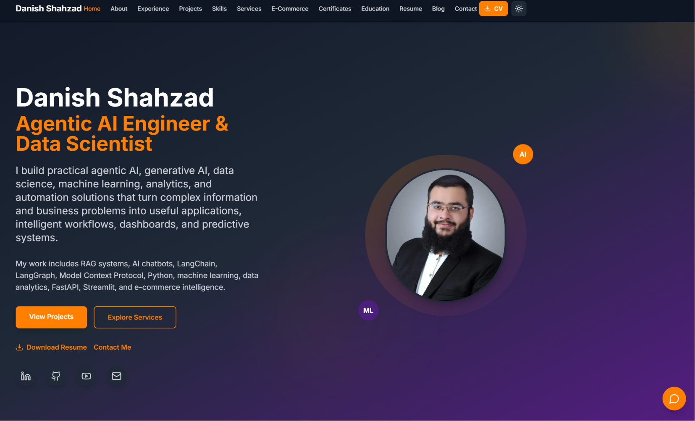
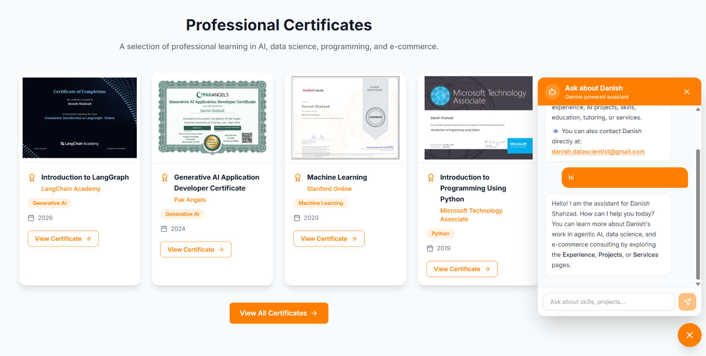
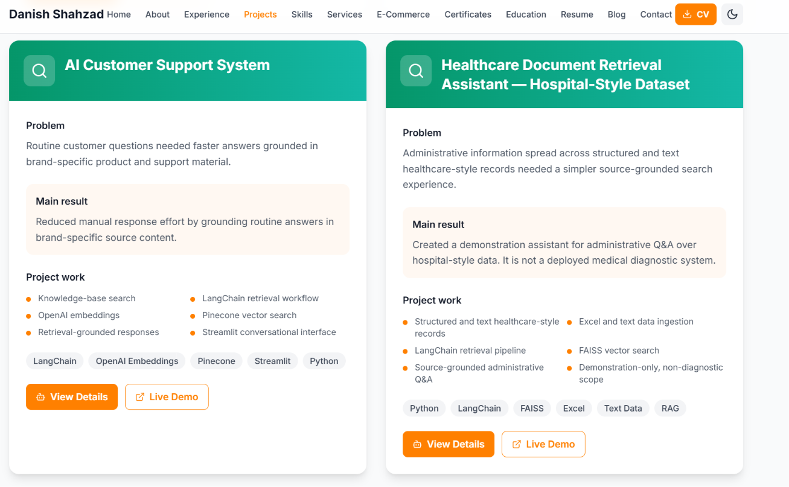

# Danish Shahzad AI Portfolio

Live site: [https://danishshahzadai.com](https://danishshahzadai.com)

## 1. What This App Is

Danish Shahzad AI Portfolio is a personal portfolio website that presents my work as an Agentic AI Engineer and Data Scientist. It is built to help recruiters, clients, and collaborators quickly understand my background, services, projects, certifications, blog content, and resume in one place.

The real problem it solves is simple: it gives people a fast way to evaluate my skills, review proof of work, and contact me without needing to search through separate profiles, documents, or platforms.

## 2. Who It Is For

- Recruiters who want to review my experience and projects
- Clients looking for AI, automation, analytics, or consulting support
- Students or learners who want to explore my blog and tutorials
- Anyone who wants to contact me directly through the site

## 3. Features

- Responsive home page with hero section and portfolio previews
- About, skills, education, experience, projects, services, resume, and contact pages
- Blog system powered by Markdown content files
- Certificates and portfolio evidence showcased across the site
- Contact form for enquiries
- AI chatbot for instant portfolio-related answers
- SEO support with metadata, Open Graph, sitemap, robots, and structured data
- Resume PDF and media assets served from the `public` folder
- Dark/light theme support
- Clean navigation between sections and pages

## 4. AI Feature

The built-in AI feature is the chatbot on the portfolio site. It answers questions about the portfolio, services, experience, projects, and background by using a system instruction that defines the portfolio context.

### What the chatbot does

- Answers visitor questions about Danish Shahzad’s portfolio
- Helps users find relevant pages, services, and capabilities
- Provides a fast interactive way to learn about the site

### How it works

- The frontend sends the conversation to `app/api/chat/route.ts`
- The backend uses the Gemini API to generate streamed replies
- The assistant is restricted by a portfolio context prompt stored in `lib/portfolioContext`
- The route limits conversation length and response size for stability

### AI instruction / system prompt

The chatbot is guided by a custom portfolio context prompt that tells the model to behave like a concise assistant for this specific website. It is intended to:

- stay focused on the portfolio
- answer accurately from the provided context
- keep replies short and helpful
- avoid inventing unrelated information

## 5. Tools, Services, and Models

- `Next.js` for the frontend framework
- `React` for UI components
- `TypeScript` for type safety
- `Tailwind CSS` for styling
- `FastAPI` for the optional Python backend
- `Resend` for contact form email delivery
- `Gemini API` for the chatbot
- `Vercel` for deployment
- `Markdown` for blog content

## 6. Live Deployment

- Public URL: [https://danishshahzadai.com](https://danishshahzadai.com)

## 7. Screenshots

Add at least 3 screenshots of the app in action here before submission.

Suggested screenshots:

- Homepage with hero section
- Chatbot open and answering a question
- Contact page or projects/blog page

Example format:

```md



```

## 8. How To Run

### Install dependencies

```bash
npm install
```

### Environment variables

Create `.env.local` from `.env.example` and add:

- `GEMINI_API_KEY`
- `RESEND_API_KEY`
- `CONTACT_EMAIL`
- `RESEND_FROM_EMAIL`

### Start the app

```bash
npm run dev
```

Open `http://localhost:3000` in your browser.

## 9. Optional Python Backend

If you want to run the FastAPI backend used for `/api/py/*` development rewrites:

```bash
pip install -r api/requirements.txt
python -m uvicorn api.index:app --reload
```

The Next.js development setup proxies:

- `/api/py/*`
- `/docs`
- `/openapi.json`

to the local backend on port `8000`.

## 10. Build And Deploy

```bash
npm run build
npm run start
```

For deployment, use the live environment variables on your hosting platform and make sure the public URL matches the one listed above.

## 11. Project Structure

- `app/` - pages, layout, components, and API routes
- `api/` - FastAPI backend
- `content/blog/` - blog markdown files
- `data/` - portfolio content data
- `lib/` - SEO and shared helpers
- `public/` - images, certificates, resume, and static files

## 12. Contact

- Email: `danish.datascientist@gmail.com`
- LinkedIn: `https://linkedin.com/in/danishshahzad17`
- GitHub: `https://github.com/Danish7861`
